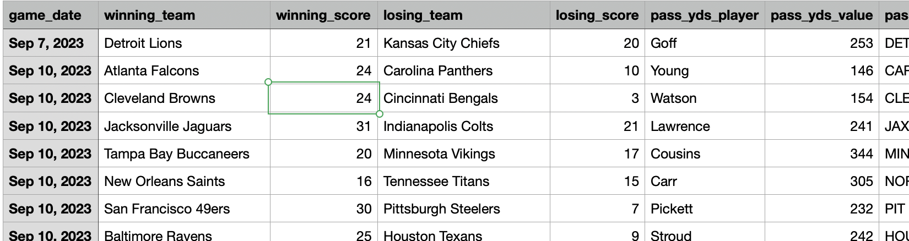
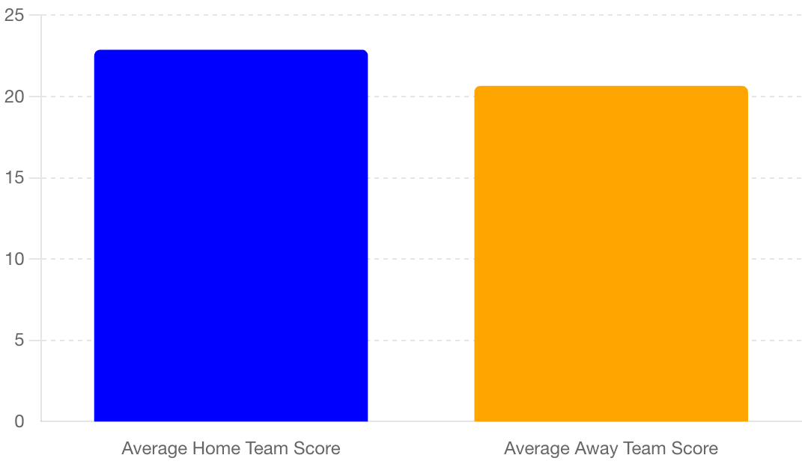
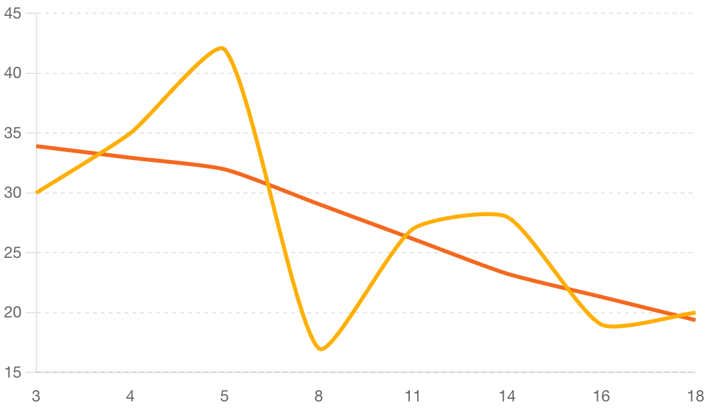
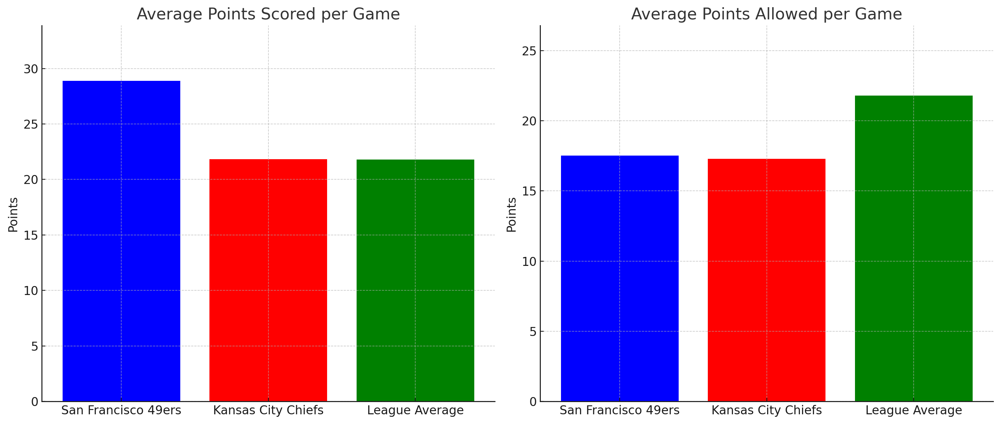

# Nfl_Data

# NFL Box Scores Data

The following table shows NFL box scores data from 2023 NFL regular season:

"2023_NFL_Season_Scores.csv"

### Explanation of Columns

\- **game_date**: The date of the game.

\- **winning_team**: The team that won the game.

\- **winning_score**: The score of the winning team.

\- **losing_team**: The team that lost the game.

\- **losing_score**: The score of the losing team.

\- **pass_yds_player**: The player with the most passing yards.

\- **pass_yds_value**: The number of passing yards by the top player.

\- **rush_yds_player**: The player with the most rushing yards.

\- **rush_yds_value**: The number of rushing yards by the top player.

\- **rush_yds_team**: The team with the most rushing yards.

\- **rec_yds_player**: The player with the most receiving yards.

\- **rec_yds_value**: The number of receiving yards by the top player.

\- **rec_yds_team**: The team with the most receiving yards.

\- **home_team**: The team playing at home.

\- **week**: The week of the NFL season.

Some of the analysis you can do :

### Average Score that the home team scores vs. the away team. Insight:  Home Field Advantage.

### Scores of the San Francisco 49ers at Home

### San Francisco and Kansas City Chiefs Offense vs Rest of the League 

